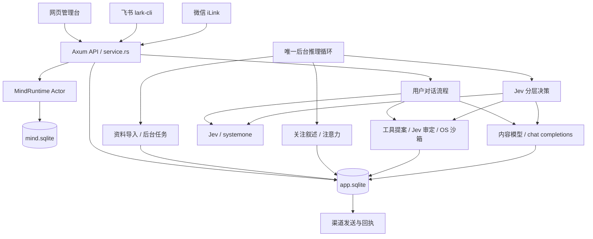

# AgentYou / YourSelf 代码现状检查

本报告是修复前快照。后续已修复工具回传、目标执行循环并加入 Chromium 搜索，Rust 工具链也已安装到临时目录用于实际编译与回归；见 [本轮修复说明](TOOL-LOOP-AND-WEB-2026-09-27.zh-CN.md)。

检查日期：2026-09-27。检查版本：`be6fd24`。本报告基于本地源码、测试定义和本次实际执行结果，不把历史报告中的通过记录当成本次验证。

项目已经是一个有持久化状态、真实模型协议、后台工作和消息渠道的单人 Agent 工作台。Rust 实现较完整，尤其在幂等、重启恢复、来源记录和本机工具隔离方面已有实质工作；仍处于快速迭代的实验产品阶段。主要欠账集中在并发撤销的一致性、渠道 I/O 对交互的影响、决策输出校验、成本与时延，以及文档和生产模式的一致性。

## 1. 项目组成与运行边界

| 部分 | 当前职责 | 规模 / 状态 |
|---|---|---|
| `crates/mind-runtime` | 事件接收、权限门禁、快照、模拟情绪、主动决策、离线回放 | 源文件 1,116 行，独立测试 481 行，版本 0.1.0 |
| `crates/yourself-server` | Axum 服务、模型调用、对话、自主循环、记忆、任务、工具、飞书、微信 | 源文件除独立 tests.rs 共 8,036 行，其中部分文件内含单元测试；tests.rs 2,610 行，版本 0.2.0 |
| `web` | 对话、记忆、活动、设置管理台 | 原生 HTML / CSS / JS，无前端框架和构建步骤 |
| `scripts` | 服务管理、RSS / 热搜 / GitHub 抓取、Jev 诊断 | Python 标准库为主；部分脚本被编译进 Rust 二进制后作为 Python 子进程运行 |
| `reference` | 早期 Python 行为契约与演示 | 可运行，但与当前 Rust 服务的行为已经有差异 |
| `docs`、README | 架构与阶段说明 | 同时保留早期授权策略和当前自主策略，阅读时必须识别版本 |

整个仓库 82 个 Git 跟踪文件；Rust 文件合计 12,243 行（包含测试）。当前 checkout 初始干净。Git 历史只有三个提交，最新提交修改许可证，前两个提交集中引入大量产品能力；变更粒度较粗，不利于追溯具体功能的演变。

主服务默认监听 `127.0.0.1:4317`，默认数据目录 `.local`。这是本地、单进程、单用户服务，当前没有 Tauri 原生外壳、多用户体系、云部署配置或安装型自启动服务。Python 服务管理脚本启动 debug 二进制。页面和静态资源通过 `include_str!` 编译进程序，改前端也需要重新构建 Rust。

仓库 [LICENSE](../LICENSE) 为自定义“非商业免费与商业付费许可证 1.0”；README 将项目标为 source-available，而非 OSI 开源。这里记录仓库声明，不对具体使用场景作法律判断。

工具执行的实际平台是 macOS：依赖 `/usr/bin/sandbox-exec`。Linux 可以承载其余服务，但工作空间工具明确拒绝无沙箱执行。Windows 不属于当前支持范围：工作空间实现存在未按平台条件隔离的 Unix API。新闻抓取另外依赖硬编码的 `/usr/bin/python3`，飞书依赖 PATH 中的 `lark-cli`。

## 2. Rust 架构：两套核心不是同一个执行层

`mind-runtime` 是较小、相对稳定的基础内核，`yourself-server` 是目前实际产品复杂度的中心。当前自主定时联系可以直接从 `heartbeat` 写入本地消息，并不总是经过 MindRuntime 的 `Speak` 决策。因此，读完 `mind-runtime` 不能等同于了解了现在的“人格核心”；实际自主行为还需要读 `heartbeat`、`decision_tree`、`drive`、`attention`、`memory`、`adaptation` 和 `workspace`。

### 2.1 MindRuntime

入口：[runtime.rs](../crates/mind-runtime/src/runtime.rs)、[store.rs](../crates/mind-runtime/src/store.rs)、[policy.rs](../crates/mind-runtime/src/policy.rs)。

- `Runtime` 是 `mpsc(64)` 命令通道的句柄；单个 Actor 持有 SQLite Connection 和待处理事件队列。
- 宿主可提交事件、改 Guards、查状态、删事件、关闭 Actor；评估等待期间通过 `tokio::select!` 继续处理控制命令。
- SQLite 与进程级文件锁保证一个 Store 写者；WAL、FULL synchronous 和事务持久化输入、决策及情绪变更。
- 输入去重按 event ID；候选防重复实际只针对已经 `Speak` 的 candidate ID。
- 评估前形成 `Snapshot`，评估后复核 revision、权限、事件和证据 TTL。任何新事件、删源或权限变更可能使旧评估成为 `Stale`，不会自动补做。
- 用户主动消息直接返回 `Respond`，不经过情绪评分；主动候选走 provider 评估。
- 模拟情绪只有 valence / arousal / control 三个数值，指数衰减加评分增量。它不是人的情绪测量，也不是经过行为实验校准的模型。
- 非 Jev 兼容决策使用固定语义阈值和加权 utility；Jev 给出 `selected_action` 后直接采用该动作，仍在外层做门禁。
- `Decision.shadow=true` 表示内核建议。真实网页和外部消息投递由服务执行。内核 `Speak` 计数在生成正文之前已增加，兼容模式下生成失败也可能占额度。
- CLI 只使用离线 MockProvider，按事件时间回放，拒绝覆盖已有数据库；CLI 成功不能证明真实模型或外部渠道正常。

### 2.2 App、锁和版本

入口：[service.rs](../crates/yourself-server/src/service.rs)。

`App` 组合应用数据库、模型客户端、MindRuntime、工作空间、会话令牌和并发控制。应用库用同步 `std::sync::Mutex<Connection>`；控制面用 Tokio Mutex；对话用容量 1 的 Semaphore；另有工具互斥锁。

`epoch` 用于设置、记忆等变化；`dialogue_epoch` 用于新对话或取消；显式停止通过 watch 信号丢弃整个对话 Future。大量提交前都有版本复核，这是现有实现的重要保障。不过“丢弃旧提交”“停止后续外部请求”“阻止旧工具副作用”目前没有形成统一的操作上下文，边界并不完全一致，详见问题清单。

### 2.3 用户对话流程

入口：[accept_chat](../crates/yourself-server/src/service.rs)、[run_jev_dialogue](../crates/yourself-server/src/service.rs)。

1. 校验文本和请求 UUID，取得唯一对话许可。
2. 事务写入用户消息和 pending 助手消息，记录依赖；后台生成返回给 HTTP 的是 accepted 回执。
3. MindRuntime 接收用户事件并返回 Respond。
4. Jev 模式先对用户正文做记忆分类，再对 user/self 两套偏好做适应评估；提交后才规划回复或工具。
5. Jev 选择 reply / wait / search_memory / create_task / use_tool，每轮重看实际结果。
6. reply 时还要用 Jev 分批选择要带入的上下文，然后调用内容模型 SSE，逐段写入 pending 消息，最后提交 done。
7. 飞书可以先发送第一段正文，再更新同一远端消息；网页按 2.5 秒轮询看到增量，微信等待最终结果。

非 Jev 路径仍存在：内容模型通过 remember / create_task / search_memory 工具处理对话，没有 Jev 自动记忆、双向适应和自主定时循环。它也没有接入当前 Read / Write / Bash 工具流程。

首次简单 Jev 回复，在无已有记忆的情况下也通常至少需要约 6 次串行请求：记忆 1 次、适应 2 批、计划 1 次、上下文筛选至少 1 批、正文 1 次。记忆越多、上下文越长，批数越多。四轮动作上限不是四次 HTTP 调用上限。

### 2.4 自主循环与所谓“精神内核”

入口：[heartbeat.rs](../crates/yourself-server/src/heartbeat.rs)、[decision_tree.rs](../crates/yourself-server/src/decision_tree.rs)、[drive.rs](../crates/yourself-server/src/drive.rs)。

唯一后台推理循环依次执行 attention、新闻、热搜、GitHub 周榜、冷启动导入、已到期工作、关注叙述更新、自主判定，然后 sleep 2 秒。渠道 I/O 和用户生成是独立 Tokio 任务。

自主判定默认开启、间隔 1 分钟；仅 TeamoRouter + decision_model=`jev` 生效。它检查持久化 next_at、对话占用、到期任务等。1 分钟是计划间隔，不是实时保障：前面的串行阶段耗时也会推迟实际唤醒。

分层决策先选 `message / continue_interest / explore / no_action`，再从宿主生成的至多六条用意中选择，也允许第二层撤回为 no_action。方向与用意按 Jev 正概率抽样；工具执行、记忆分类和上下文带入使用 argmax。抽样记录 draw 和 seed，可复盘。

`drive` 目前存的是长期 / 中期 / 短期三段自然语言。内容模型提出修改，Jev 逐层决定 keep / revise。旧 objective / next_step / status 等字段被迁移为历史叙述，已不再是当前目标生命周期。`attention` 数值初始 60，三层粘性 .95 / .7 / .2，每小时衰减 .05 / .5 / 5；强化按粘性缩放。分数归零不会删除叙述。

稳定价值内核是代码里的提示词。所谓成长是记忆、叙述、偏好版本和数值参数变化，并不修改 Rust 程序或模型权重。具体消息生成模型可配置，不必一定是 DeepSeek。

### 2.5 记忆、画像、上下文与 Skills

入口：[memory.rs](../crates/yourself-server/src/memory.rs)、[adaptation.rs](../crates/yourself-server/src/adaptation.rs)、[jev_window.rs](../crates/yourself-server/src/jev_window.rs)、[skills.rs](../crates/yourself-server/src/skills.rs)。

- 自动记忆是原文按 900 字分片后分类保留；不是语义摘要，也不是完整知识库。单次分类最多 24 片。
- 记忆带来源、fragment 序号和依赖；`source_id + fragment` 去重。新资料可以 supersede 老理解，老记录保留但从有效检索排除。
- 检索在最新最多 4,000 条有效记忆中，按词和二字片段匹配数排序。没有向量、Embedding、FTS，也没有最低相关度门槛；零匹配时也可能带入近期记忆。
- user/self 画像各有表达详略、主动程度、求证、不同意见表达四维，observe 和 adopt 分开；历史版本保留，恢复生成新版本。
- 对话上下文与主循环上下文共享人格、记忆、真实交互；新闻、工具历史、内部成果主要在 loop_state 中。实际主动消息才进入聊天记录。
- Jev 每批最多四题，序列化整份请求上限 24 KiB。结构化历史按 LFU 和最近访问淘汰，必要时还会字符串投影；这不是精确 token 窗口，也不是完整事实可见性保障。
- 分层决策另有很强的节选：一般字段 650 字，最近四条互动每条 90 字。因此实际选择时看到的用户表达可能远少于本地存储原文。
- Skills 是 SQLite 中的带版本方法记录；保存要有真实用户消息或成功工具来源，并由 Jev 看具体参数后允许。它不是自动安装插件、修改权限或训练模型。

## 3. 数据与外部能力

`app.sqlite` 包含配置、聊天、任务、记忆、依赖、模型账目和请求详情、画像版本、自然语言关注、注意力、Skills、世界快照、导入进度以及各渠道收发记录。`mind.sqlite` 包含 persona、Guards、revision、affect、事件 inbox、appraisal 和 decisions。

应用库目前主要通过各模块的 `CREATE TABLE IF NOT EXISTS` 初始化，没有统一 schema version 和正式迁移框架；MindRuntime 库有 schema=1 和 persona 一致性检查。大部分 app 表没有外键或业务状态 CHECK，跨表一致性主要依赖 Rust 和手写 SQL。已有部分唯一约束，但缺少针对 due_at、status、created_at、dependencies.source_id 等频繁查询的业务索引。

| 能力 | 已实现 | 实际限制 |
|---|---|---|
| OpenRouter / TeamoRouter | 固定 HTTPS endpoint、Key 分离保存、结构化输出、账目、错误分类 | 真实服务商和模型兼容性不能由 fake HTTP 测试保证 |
| 原生 Jev | `/systemone`、Choice / Noul、分批、一次临时失败重试、请求详情与实际选择记录 | 当前自主机制依赖这条协议；失败没有聊天模型决策回退 |
| 文件 / Bash | macOS OS 沙箱、工作目录校验、禁网络、清空环境、输出上限、35 秒超时、进程组回收 | 允许覆盖工作空间文件；语义上是否该执行由 Jev 判断，没有文件修改审批 UI |
| 浏览器 | 有适配代码 | `BROWSER_READY=false`，不向模型开放，相关浏览器测试忽略 |
| 飞书 | 绑定本人的私聊文字、轮询/事件、请求去重、uuid 发送、流式更新、回执 | 依赖本机 CLI 身份和真实协议；无群聊、图片、语音、文件处理 |
| 微信 | iLink 扫码、官方域名限制、绑定用户、持久 cursor/inbox、2000 字拆分 | 接收后先建立 context 才能发；长消息中途失败没有逐段恢复机制 |
| 冷启动 | 明确资料+云处理授权、路径队列、分批、断点恢复、原子发布、撤销 | UTF-8 指定扩展名；每文件 2 MB；飞书最多 200 条；文件数虽不限，最终发布会一次加载全部分类结果 |
| 世界背景 | RSS 每天、百度热搜每小时、GitHub 周榜每天、上海天气/潮汐/月相估计 | 部分抓取由 Python 完成；天气缓存只在内存，重启后可能重新抓取；外部版式变化会导致失效 |

Key 明文保存在本机应用库，微信凭据也保存在该库；飞书凭据由 lark-cli 管。目录 0700、应用库 0600，网页不回显 Key，请求日志按 Key 和敏感字段脱敏。最近 100 次模型报文保留原始上下文；这仍是个人敏感内容，应与“日志没有 Key”分开理解。

网页有回环监听、Host / Origin 校验、会话令牌、CSP 和正文转义。该令牌保护跨站访问，不是本机用户间身份隔离；同机其他进程仍能获取首页。现有安全模型适合单人本地使用，不足以直接暴露公网。

重启把 pending 对话、running 工作标为失败，把未确认模型调用标 unknown；冷启动例外可以续跑。外部 sending 回执变 unknown，不自动重发。本地 outbox 的 SENT 表示网页消息已提交，不代表飞书/微信已发送或用户已读。两套渠道另有回执表。

## 4. 当前自主模式与文档的关键差异

生产构造函数 [App::open](../crates/yourself-server/src/service.rs) 无条件调用 [enable_ai_cadence](../crates/yourself-server/src/data.rs)。它会：

- 设置 ai_driven=true，清除 paused / quiet / busy。
- 开启所有现存主动类别 consent，将次数设 u32::MAX、冷却设 0。
- 把 daily_call_limit 改为 0，表示不限模型调用次数。
- 后续保存设置再次套用该模式，不能通过设置重新启用这些旧限制。

这是明确的产品行为，测试也专门要求它，并非误删门禁。云调用开关、资料导入授权、工作空间隔离、渠道连接和 heartbeat 开关仍有效。但当前没有独立的主动类别 opt-in；禁用 heartbeat 也不等于停止后台任务或禁止任务完成通知。

README 前面的新说明提到了这些变化，后面仍有“暂停 / 调用预算不足时等待”“分类授权与免打扰门禁”“最多三次工具步骤”“不逐 Token 显示”等旧说明。飞书连接成功的自动文案仍教用户 `/pause` 和 `/resume`；当前 ai_driven 模式下这两个命令不走本地控制分支，而会落入普通模型对话。`PRODUCT.md` 仍以飞书单渠道为主，而实际代码已加入微信。阶段总结与原始架构可以用于理解历史，不能当当前行为规格。

## 5. 优先问题清单

以下是静态检查得到的具体问题与执行条件；除验证章节注明的命令外，未在 Rust 或真实渠道运行复现。P1 表示应优先处理，P2 表示随后处理的重要正确性问题。产品自主策略本身不列为缺陷。

### P1：渠道发送在网络等待期间持有全局控制锁

位置：[feishu::outbound](../crates/yourself-server/src/feishu.rs)、[weixin::deliver](../crates/yourself-server/src/weixin.rs)。

两个函数取得 `app.control` 后一直持有，期间 await 远端创建/更新/发送。飞书单次 CLI 超时 35 秒，微信单次请求超时 40 秒，微信分段循环也在同一把锁内。发送慢或卡住时，网页接收新对话、停止生成、保存设置、删除记忆、断开渠道等也必须等待这把锁。用户对话任务与渠道任务虽然独立，实际交互响应仍可能被渠道 I/O 阻塞；长微信消息可以累积多次等待。

建议：锁内校验与原子预约发送，锁外 I/O，锁内按 generation / receipt 提交结果。另设每渠道发送互斥，明确断开期间已预约发送的处理规则。

### P2：argmax 对全零 / 负数“概率”仍可授权执行

位置：[jev::selected](../crates/yourself-server/src/jev.rs)、[workspace::step](../crates/yourself-server/src/workspace.rs)。

`selected` 只检查浮点有限性，没有检查非负或存在正概率。工具审批选项顺序是 execute / skip，因而 `{"execute":0,"skip":0}` 会选择 execute；`{"execute":-1,"skip":-2}` 也会选择 execute。抽样函数已经拒绝没有有效正概率的答案，但权限 argmax 没有同样处理。

建议：不必要求总和为 1（当前协议刻意允许非归一化权重），但应拒绝负数、全零和缺失的必需选项；权限选择对不完整或无有效权重的回答返回错误，并添加畸形响应契约测试。

### P2：旧后台工具与内部整理没有完整的新对话失效检查

位置：[heartbeat 工具调用](../crates/yourself-server/src/heartbeat.rs)、[workspace::step](../crates/yourself-server/src/workspace.rs)、[内部整理提交](../crates/yourself-server/src/heartbeat.rs)。

heartbeat 在工具选择后检查 dialogue_epoch，之后 workspace::step 自己采样 epoch，只在执行前检查设置/记忆 epoch，没有携带原始 dialogue_epoch。若用户在工具提案或 Jev 审批等待期间发来纠正，新对话会增加 dialogue_epoch，但旧后台 Write / Bash 仍可能执行。内部整理分支在生成、分类与适应后，只复核 app epoch，未复核原 dialogue_epoch，也可以提交已过时的整理和偏好；主动消息分支反而有明确的新对话复核。

建议：所有后台操作传入同一个 RunContext，包含创建时的设置与对话版本；副作用执行前和状态提交前均复核。工具本身的运行中取消需另行定义，不能只依赖结果不提交。

### P2：第四轮仍可调用工具，然后将整轮回复标失败

位置：[run_jev_dialogue](../crates/yourself-server/src/service.rs)、[UseTool 分支](../crates/yourself-server/src/service.rs)。

循环是 `0..4`，传给 Jev 的 remaining_tool_rounds 在第四轮为 0，但 available_tools 仍存在，plan 仍允许 use_tool，UseTool 分支也没有硬判断 `round == 3`。因此连续四次 use_tool 可以执行第四次文件/命令副作用，随后循环退出报“达到上限”，最终用户看到失败，即使工具已经做了事。不能用提示词中的剩余轮数代替宿主限制。兼容旧流程有类似末轮工具检查，新流程没有沿用。

建议：最后一轮移除工具候选，或在副作用前硬拒绝，并要求该轮只能 reply / wait。验证应覆盖第四轮的实际副作用，而非只检查提示词。

### P2：删除记忆后，旧生成仍可继续请求并重新写入含旧资料的调用日志

位置：[forget_memory](../crates/yourself-server/src/service.rs)、[system_one 分批循环](../crates/yourself-server/src/openrouter.rs)、[上下文筛选](../crates/yourself-server/src/jev.rs)。

删除操作清空 call_traces 并增加 app epoch，但不会发送对话 cancel watch 信号。多批 system_one、select_dialogue_context 等函数已持有旧资料，没有在每批出网前核验开始时 epoch。若删记忆发生在批间或等待期间，后续批仍可能发送其缓存中的旧上下文，trace_request 也会重新创建包含旧资料的日志。提交前的 epoch 检查可以阻止旧最终回复入库，却不能阻止这些后续请求或日志写回。

建议：把 epoch / cancellation 传到模型调用边界，每次新请求前复核；删除时中止依赖旧上下文的生成，对日志写入也校验资料版本。不能撤回已经送达服务商的请求，但可以阻止尚未发出的后续批。

### P2：超大请求投影可能截断最新用户请求与必要事实

位置：[jev_window::project](../crates/yourself-server/src/jev_window.rs)、[prepare](../crates/yourself-server/src/jev_window.rs)。

LFU 阶段保留最近两条记录，但随后的 project 递归截断字符串和数组，保护的是 exact_arguments / tool_args / proposed_prose 三类键，不包括最新 user 正文或 event.text。因此“保留记录”不等于“保留原文”。对 packed Markdown 字符串，LFU 也无法识别里面的历史单元，最终是直接截前缀。必要项过大时，目前可以退化成极小观察继续判定，而不是总会本地拒绝；README 的“最新两条保持完整 / 必要项超限拒绝”不能完整描述实际代码。

建议：定义必须完整的当前用户请求、授权与工具参数；这些内容本身过大时返回 split_required。可选历史才做节选，并在日志中明确列出被裁剪字段。

## 6. 其他重要工程边界

- **删除范围很大。** 删除任意一条记忆会无条件清空全部 learned_skills、goal_history、workspace_events 和调用详情，重置关注与分支倾向，并传播删除派生消息/记忆、取消派生工作。这是实际代码行为，不是仅删除单条记忆；没有预览影响列表。memory_provenance / memory_revisions 等辅助记录也没有统一清理规则。
- **冷启动并非全程固定内存。** 扫描是分批的，最后发布会把任务的所有分类结果 collect 成 Vec 并在一个事务里写入。大目录导入会有最终内存与锁持有时间峰值；“文件数不限”不代表任意体量都已验证。
- **图片、语音、文件和浏览器未形成完整能力。** 目前本质是文字助手加 macOS 工作目录操作，不宜由旧目标文档推断更广能力。
- **内容模型可以提出任意工作目录 Bash。** OS 沙箱限制越界读写和网络，能防住一类技术越权；它不证明脚本对用户当前目标合理。工作空间内误覆盖、删除等仍主要依赖 Jev 的语义判断。
- **数据库操作仍同步运行在 Tokio 线程上。** 多数事务短小，单人阶段可接受；全量删除、导入发布、历史检索和频繁 FULL synchronous 写入规模增大后可能影响响应。
- **后台所有阶段串行。** RSS 最多 30 条的评分就可能需要八批 Jev 请求，加导入/任务/关注评估后，一轮可能很长；没有每阶段统一时间预算和分阶段调度公平性。
- **调用账目不是美元预算。** 当前生产每日调用上限禁用；TeamoRouter 聊天费用被剔除，未知费用仍可能存在。后台自动调用和批量上下文选择会扩大实际调用量。
- **可观察性有实质基础，但错误类型较弱。** 有请求详情、选择、回执和任务状态；AppResult 主要是 String，API 多数统一 400，多处忽略写库错误或阶段错误，阶段状态可能随后覆盖前阶段异常。没有统一 tracing 和结构化错误码。
- **核心接口边界偏宽。** App / OpenRouter / Database 暴露较多内部字段和数据库 lock，业务模块直接拼 SQL 与 Value。service.rs 和 data.rs 都较大，兼容代码和现用代码混合，重构时容易漏一条路径。
- **长期数据未统一治理。** 报文保留最近 100 次、LFU 有 4096 项限制，但消息、事件、调用账目、画像版本等持续增长；没有成熟导出、备份、压缩和统一清理方案。

## 7. 验证现状

| 检查 | 本次结果 | 可证明的范围 |
|---|---|---|
| Python reference unittest | 29 / 29 通过 | 参考实现的事件与策略契约；不证明当前 Rust 自主模式 |
| Python scripts unittest | 2 / 2 通过 | GitHub 周榜解析样本 |
| `node --check web/app.js` | 通过 | JS 语法，未验证浏览器 DOM / 交互 |
| `python3 scripts/service.py status` | Not running | 当前 checkout 未报告运行服务；不是历史服务稳定性检查 |
| `cargo test --locked --workspace` | 无法执行：cargo 不在 PATH，常见本机安装路径也未找到 | Rust 编译与测试未经本次动态验证 |
| Rust fmt / clippy / CLI replay | 同样受工具链缺失限制，未执行 | 不提供“本次通过”的结论 |
| 真实 Jev / 模型 / 飞书 / 微信 | 未调用 | 未检查真实凭据、费用、endpoint 和消息收发效果 |

源码中有 89 个 Rust test 属性：mind-runtime 16 个、yourself-server 73 个，包含文件内单元测试和一个被忽略的浏览器测试。部分工作空间测试只在 macOS 编译。这是声明数量，不是本次执行通过数量。

CI 配置运行 Ubuntu stable Rust 的 fmt、clippy、workspace test、Python reference 和 CLI replay。当前没有 Rust 最低版本 rust-version / toolchain 固定文件；CI 使用 rolling stable。CI 未运行 scripts 的 GitHub 解析测试，也不会覆盖 macOS-only 的工作空间沙箱测试。

服务测试有真实本机 HTTP fake server，覆盖请求结构、Key 分离、幂等、撤销、账目、记忆、画像、上下文隔离、流式增量和自主模式，质量明显好于单纯函数 mock。但多数 Harness 手工构造 App、默认使用旧 Guards 模式，只有部分测试显式启用 ai_cadence；它没有统一复用生产 App::open，也没有完整启动三条长期任务。飞书流式测试走内置 CLI fixture，微信主要是纯函数边界测试，因此不能据此判断真实渠道完整可靠。

下一轮验证优先补：渠道网络等待时的取消响应、新消息阻止旧工具执行、权限概率全零/负数、第四轮副作用、删记忆期间批间新请求，以及真实 App::open 启动恢复。它们能直接覆盖本次发现的边界，价值高于继续增加正常 happy path 样例。

## 8. 阅读路线与处理顺序

建议先读以下模块，顺序对应真实调用关系：

1. [服务入口 main.rs](../crates/yourself-server/src/main.rs)：监听、启动长期任务、关闭。
2. [App 与对话 service.rs](../crates/yourself-server/src/service.rs)：上下文边界、授权版本、入口和提交。
3. [数据库 data.rs](../crates/yourself-server/src/data.rs)：真实数据模型、事务、状态恢复和删除。
4. [后台 heartbeat.rs](../crates/yourself-server/src/heartbeat.rs) + [分层 decision_tree.rs](../crates/yourself-server/src/decision_tree.rs)：现在实际决定做什么和是否联系的代码。
5. [协议 openrouter.rs](../crates/yourself-server/src/openrouter.rs) + [Jev jev.rs](../crates/yourself-server/src/jev.rs)：模型调用量、出网边界与选择规则。
6. [memory.rs](../crates/yourself-server/src/memory.rs) + [adaptation.rs](../crates/yourself-server/src/adaptation.rs) + [drive.rs](../crates/yourself-server/src/drive.rs) + [attention.rs](../crates/yourself-server/src/attention.rs)：记忆与人格连续性究竟如何实现。
7. [workspace.rs](../crates/yourself-server/src/workspace.rs) + [skills.rs](../crates/yourself-server/src/skills.rs)：副作用、权限和能力边界。
8. 再读 [MindRuntime](../crates/mind-runtime/src/runtime.rs)，理解稳定基础与兼容策略，避免把它误认为全部产品核心。

处理顺序：先修全局锁跨网络等待、统一操作版本/取消上下文；再补决策校验与最后一轮工具硬限制；随后统一当前文档、增加生产启动与 macOS 契约验证；最后才做数据库迁移/索引、模型调用合并与上下文压缩质量优化。新增人格功能之前，先稳定这些现有路径更有价值。
