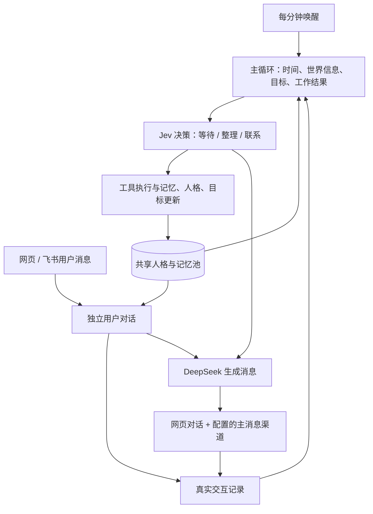

# 知微阶段总结 · 2026-09-23

> 历史阶段记录：当前工具循环、任务分类和浏览器实现见 [2026-09-27 修复说明](TOOL-LOOP-AND-WEB-2026-09-27.zh-CN.md)。

本阶段交付本地 Agent 工作台：Rust / Tokio / Axum 后端、SQLite 持久化和静态 Web 前端。代码形成首次 Git 提交；按用户最新要求仅本地提交，不推送。产品服务保持停止，本次验收不调用真实模型。

## 架构与已实现能力

主循环和用户对话使用两个独立上下文，共享人格、长期记忆和真实交互。主循环按阶段推进世界信息更新、授权冷启动、内部工作、目标审定和每分钟行动判定；用户对话独立响应，不等待后台模型结束。飞书收发使用独立轮询。

- **模型分工**：OpenRouter / TeamoRouter 配置接入；Jev 使用原生 `/v1/systemone` 判定，按返回概率选择最高项；DeepSeek 负责内容生成。Jev 决定记忆保存、人格和用户理解更新、目标取舍、工具执行与主动行动。
- **上下文边界**：对话使用共享记忆、已采纳目标和实际聊天；世界新闻、热搜、内部工作与未发送草稿属于主循环，不整体注入对话。“欢迎来到这个世界”仅用于主循环。
- **人格与目标**：初始人格通过真实交互适应；核心强调诚实、独立探索、尊重用户注意力与可验证结果。目标包含动机、下一步、成功标准和证据，由 Jev 审定并持久化。
- **联系能量**：最多连续三条未回应主动消息，用户发言恢复能量，时间流逝不恢复。发送时再次检查状态；生成期间收到新消息会使旧主动草稿失效。这是用户后续新增的约束。
- **消息渠道**：主动消息直接进入网页对话，并投递到配置的主渠道；已接飞书，保留既有连接并通过轮询收消息。后台任务 tab 已移除。
- **冷启动**：用户授权后读取指定资料和飞书历史，目录分批处理，不设目录总文件数上限；保留单文件体积限制。Jev 筛选后更新上下文，不执行资料里的历史指令。
- **世界信息**：北京时间日期与当前时间；每日精选最多 10 条 RSS 新闻、每小时热搜、每日刷新 GitHub 周榜快照。使用公开来源、持久缓存和来源链接，不需要额外新闻 Key。
- **工具**：工作空间 Read / Write / Bash / sed；macOS 系统沙箱限制写入工作空间，Bash 不授予网络权限，记录工具参数、判定与结果。无头浏览器尚未启用。
- **活动页**：最近 100 次模型交互，显示请求、响应、Jev 选项与原始概率、实际选择、Token、耗时和费用信息；缺失费用不记作零。

`mind-runtime` 和 `reference/` 保留早期事件运行时与离线参考实现，其中旧配额和影子决策不等同于当前工作台行为。

## Jev 固定窗口与诊断结论

原生 Jev 请求在发送前限制为 **24,576 字节 UTF-8 序列化请求体**，不是精确 Token 数。持久 LFU 对可淘汰历史排序，同频按最近访问时间处理；保留当前问题、关键候选参数与最近交互。淘汰只影响本次上下文，不删除长期记忆。必要内容仍超限时本地报错，不截断工具参数。调用记录包含窗口裁剪元数据。

**稳定线上调用尚未解决。** 先前测试中，官方最小示例与 TypeSafe Python SDK 0.7.1 经当前 TeamoRouter 地址、Key 和网络路线都返回 HTTP 503，响应为 `System One endpoint is disabled`。缩小上下文后仍可复现，因此不能把这些失败简单归因为上下文大小，也不能据此断言 Jev 全局停用。

详细证据和复现脚本见 [Jev 诊断记录](jev-diagnostics-2026-09-23.md)、`scripts/check_jev.py` 和 `scripts/check_jev_sdk.py`。这些脚本会真实请求接口，当前不运行。后续需要与已知成功请求对照账户、路由、模型别名和网络路径。

## 验证结果

本次提交前使用离线测试与本地 mock 验证，未启动产品服务：

- `cargo fmt --all --check`：通过。
- `cargo clippy --locked --offline --workspace --all-targets -- -D warnings`：通过。
- `cargo test --locked --offline --workspace -- --test-threads=1`：71 项通过，1 项浏览器测试明确忽略。
- Python 参考实现：29 项通过；GitHub 周榜解析：2 项通过。
- `node --check web/app.js`：通过。
- `python3 scripts/service.py status`：`Not running`。

测试覆盖上下文隔离、聊天并发、主动消息落库、能量恢复、目标持久化、LFU 窗口、批量冷启动、工具写入边界、调用记录和数据删除。离线通过不代表 Jev 线上可用性已恢复。

## 当前限制和后续工作

1. Jev 503 原因仍待定位；用户允许恢复真实测试后再继续，不以其他模型静默替代。
2. 无头 Chromium 在外层系统沙箱内初始化嵌套沙箱失败，工具保持禁用；未采用关闭 Chromium 内部沙箱的方案。
3. Key 目前保存在权限受限的本地 SQLite 中，尚未使用 Keychain 加密存储；`.local/`、数据库、日志、构建与运行产物不提交。
4. 当前为单机本地 Web 工作台，无开机自启，非多用户公网服务；回复尚未逐 Token 流式显示。
5. 下一阶段优先解决 Jev 可复现稳定调用和浏览器隔离运行，再进行真实飞书与自主循环联合验收。

未经用户重新要求，不启动服务、不恢复轮询或真实模型测试。
