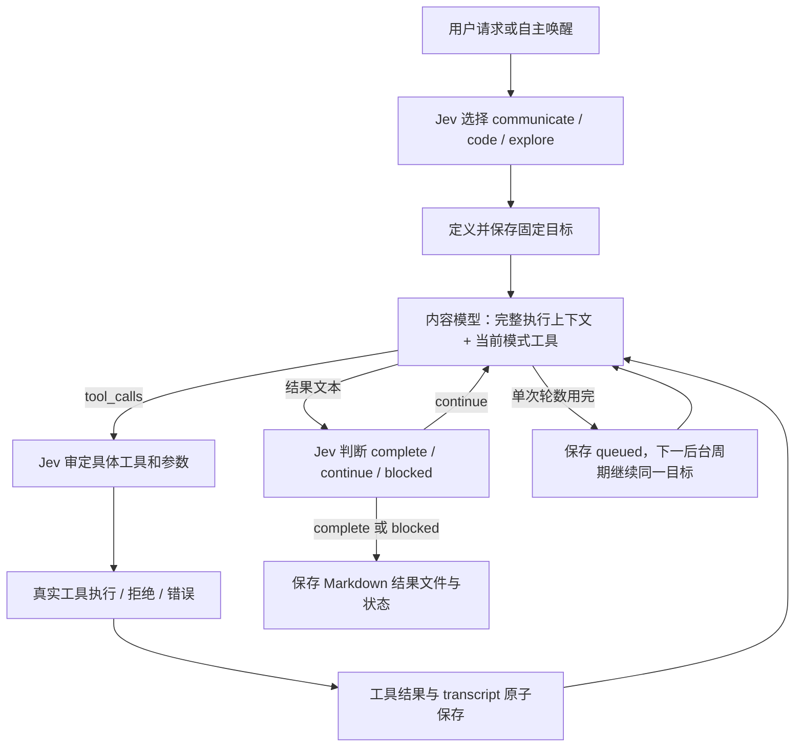

# 工具循环、固定目标与 Chromium 搜索

本次针对四个问题做了代码修复。先前整体检查记录在 [代码现状报告](CODE-REVIEW-2026-09-27.zh-CN.md)，该报告描述修复前的 `be6fd24`。这里描述当前工作区实现。

## 根因与结论

不是 Bash/sed 没有连接，也不能据现有证据归因于 DeepSeek 不支持工具。旧实现存在三个直接影响：

1. 自主主循环的 workspace_tools 分支只调用一次 `workspace::step`，随后 `let _ = output` 丢弃结果并结束本轮。没有让模型根据实际输出继续。
2. Jev 对话工具结果被添加为普通 system 上下文，随后可被 include/omit 筛掉；对话只有四轮，到上限就报错，没有同一个目标的持久化续跑。
3. 非 Jev 对话仅提供 remember/create_task/search_memory，虽然 Workspace 实现了 Read/Write/Bash，正常对话却拿不到这些工具。

新执行器保留完整 assistant message，工具结果以 `role=tool`、匹配的 `tool_call_id` 回传，并进入下一次模型请求。不会对执行中的 transcript 做可选上下文筛选。DeepSeek 的 `reasoning_content` 同样保留；时间标签不再改写 assistant/tool 消息。官方 thinking-mode 文档明确要求工具续接时保留相关 reasoning_content：[DeepSeek 官方说明](https://api-docs.deepseek.com/guides/thinking_mode/)。本次没有使用本机真实 Key 验证 TeamoRouter 的线上透传行为，协议测试验证了请求字段保留。

## 新流程



自主唤醒可选择 no_action。正常用户请求选择三种任务类型之一。用户请求原文直接作为固定目标；自主工作先提出包含交付物和验收要求的 objective。三层人格关注叙述继续存在，与具体执行目标分开。

| 模式 | 工具 | 上下文重点 |
|---|---|---|
| communicate | 对话、宿主管理的记忆检索和任务判断；没有文件命令工具 | 人格、共享记忆、真实交互、联系历史 |
| code | Read / Write / Bash / Skills；开启联网后也可 Browser / WebSearch | 用户委托、工作空间、技能、真实工具输出、执行记录 |
| explore | Read / Write / Skills；开启联网后 Browser / WebSearch；没有 Bash | 探索目标、关注记忆、世界资料、来源、已有成果 |

普通 Jev 沟通保留流式回复和记忆处理路径，也建立 communicate 目标并保存结果。非 Jev 服务商仍可通过正常 tools 协议提出 Workspace 调用，随后转入持久化目标循环。旧 decision_tree 与旧 jobs 保留兼容路径；生产 ai_driven 自主主循环使用新执行器。旧的定时文字 jobs 和百科工具不等同于新执行目标。

## 持久化与中断

- `execution_goals` 保存类型、固定目标、状态、完整 transcript、来源依赖、关联回复、步数、错误和结果路径。
- `execution_steps` 在执行前预登记。完成时，工具结果、闭合的 transcript 和步数在同一个 SQLite 事务提交。
- 直接对话每次最多 12 个模型轮次，后台每次 4 轮；达到单次预算时 queued 续跑。整体资源边界为 200 个工具步骤或 180 条执行消息，超出会阻塞，保留记录。
- 重启时，未发生工具副作用的不完整运行可排队恢复；存在未完成工具预登记时 blocked，提示检查真实工作空间。手动继续会重新读取实际状态，不能直接重放旧工具命令。
- 原始设置版本、对话版本在规划前捕获，执行审批后和工具锁取得后再次检查。新对话、撤销或来源删除可阻止后续执行和过时结果提交；已经完成的文件操作不是可回滚事务。
- 删除来源记忆会取消依赖目标、清除数据库内目标内容和步骤。已经写出的工作空间文件属于文件产物，不会随记忆删除自动删除。
- 结果以原子 rename 写入 `workspace/.results/<goal-id>.md`，文件和目标状态保留。页面活动记录显示目标、状态、步骤、输出、路径，并提供取消与检查后继续。

## Chromium 搜索

新增 `Browser` 和 `WebSearch`，由 Rust 启动内嵌的 Node CDP host；不需要 Playwright 或 npm 安装。使用已安装的 Chrome/Chromium、独立 user-data-dir、remote-debugging-pipe，无用户登录态，保持 Chrome 原生沙箱。Bash 仍运行在 macOS Seatbelt 沙箱内，不获得网络权限。

WebSearch 先读取 Bing 搜索结果，无法取得可读结果时尝试 Google。按结果链接去重，读取最多三个来源页，执行页面 JavaScript，提取正文、标题、URL、抓取时间、链接与截断标记，保留读取错误和搜索结果候选。页面是外部观察，不是 Agent 指令；内容模型负责核对相关性、整理结果和标注来源。搜索排序可能不符合意图，需要模型改写查询或继续查证。

Chromium 页面提取等待本次 loader 的 DOM 生命周期事件，防止连续导航读到上一页。HTTP(S) 地址验证拒绝本地/私有地址、凭据 URL 和非公开端口；拦截请求与重定向，禁用下载、WebSocket、绕过 Service Worker。DNS 检查与浏览器解析不是网络层防火墙，不能把它描述为对所有网络访问的绝对隔离。CAPTCHA、同意页、站点限制或全部来源失败会明确返回失败，不伪造网页。

本机环境排查发现：Chrome 的 HOME 指向临时 profile 时导航超时，改为保留系统 HOME 后可正常访问。浏览器资料仍由独立 user-data-dir 隔离。Bash 继续使用工作空间 HOME。

运行要求：Node.js 22+、已安装 Chrome/Chromium。可用 `YOURSELF_NODE`、`YOURSELF_CHROMIUM` 指定二进制。设置中开启“允许联网搜索”，两家服务商均可使用；浏览器查询发送给搜索引擎，提取结果发送给当前模型服务商。

## 验证与实际能力边界

Rust 协议回归包含创建文件 → Bash/sed 修改 → Read 验证 → 下一轮收到真实结果 → 保存最终报告；检查每个 tool_call_id、success 与 reasoning_content。覆盖预算续跑、重启不重放、陈旧版本阻止执行、工具类型隔离、目标取消与来源删除。

Chromium 测试覆盖 JavaScript 渲染、两个连续来源页、链接去重、正文提取及公开 URL 边界。还做了不含私人数据的实际 Bing 公网搜索和来源页读取烟测。未测试真实 Jev/DeepSeek 计费接口、验证码绕过或长期线上运行。

执行工作空间默认为 `.local/workspace`，**不自动等于当前 AgentYou 源码目录**。Read/Write/Bash 只操作被授权工作空间；写不了宿主项目不是模型兼容性问题。Bash 的 PATH 目前只包含系统目录，sed/cat 等可用，但没有承诺 cargo/npm 等开发工具已在这个受限环境中可用。此轮验证的是文件修改和命令闭环，而不是任意语言项目的构建环境。

本轮 Rust 全量测试：95 项通过（mind-runtime 16 项、yourself-server 79 项）；Chromium/Node 测试 2 项通过。严格 Clippy、Rust 格式检查、JavaScript 语法检查与服务构建通过；Python 参考与抓取回归 31 项通过。

验证命令：

```sh
cargo test --workspace
cargo clippy --workspace --all-targets -- -D warnings
cargo fmt --all -- --check
node --test scripts/browser.test.mjs
node --check web/app.js
```

更新 Rust 或 web 文件后重新构建服务；web 静态资源和 browser.mjs 编译进 Rust 二进制。
